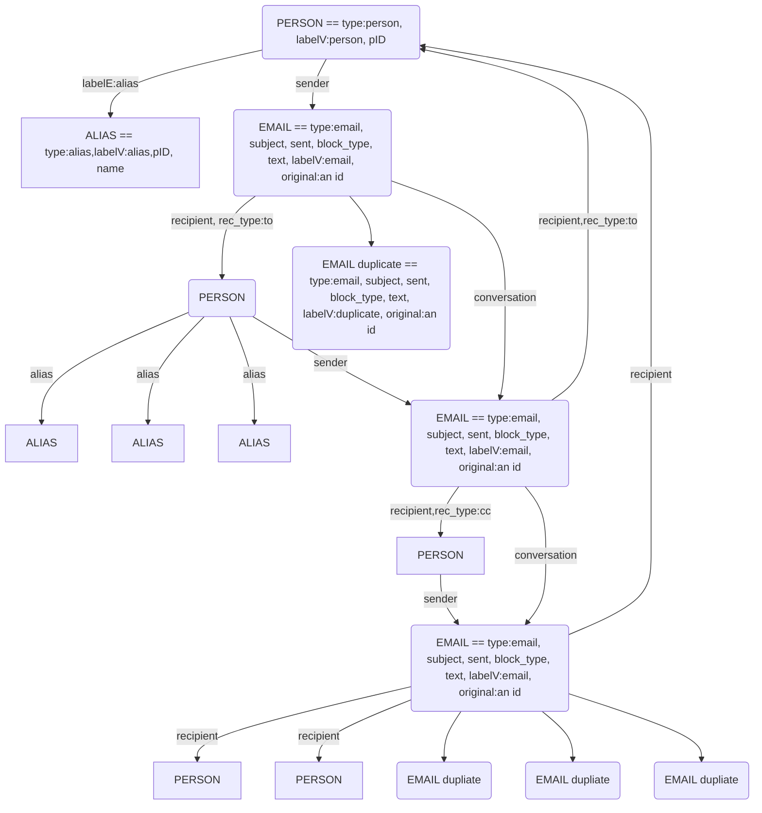

## Pipeline
The pipeline uses [JUST](https://github.com/isi-nlp/JUST) to wrap the different scripts.

Execute the pipeline like so:
```bash
python3 just/just.py pipeline.just
```

## GraphML Skript
Assuming default options: 
```
python scripts/build_graphml.py --people data/people.txt --quagga-parsed data/parsed_enron.json --graph data/enron.graphml --include-text
```

## TinkerPop Gremlin tips
```
graph = TinkerGraph.open()
graph.io(IoCore.graphml()).readGraph("/path/to/graph.graphml")
g = graph.traversal()

# who has the most aliases
g.V().hasLabel('alias').groupCount().by('pID').unfold().order().by(values,decr).limit(10)

# see the actual list of aliases for some people
g.V().hasLabel('person').order().by(outE().hasLabel('alias').count(), decr).limit(5).out('alias').group().by('pID').by('name').unfold().skip(3)
g.V().hasLabel('person').order().by(outE().hasLabel('alias').count(), decr).out('alias').group().by('pID').by('name').unfold().skip(10).limit(5)
```

## GraphML structure 

